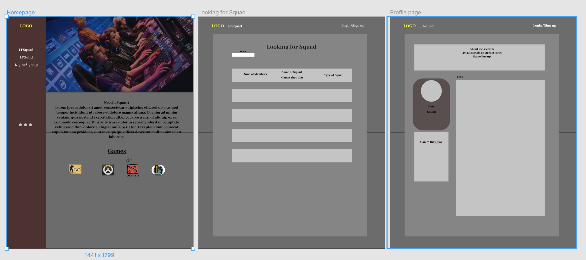

# Squad-up
---

## Usage

 **A platform to find teammates and play your favorite pc games**
 
*Currently only supporting **Counter-Strike Global Offensive**, **League of Legends**, **Overwatch**, **Dota2** with plans to add more in the future.*

1. **Personal profiles** 
    * New users can sign in or create new profile with discord, steam or email.
    * List of squads they play with.
    * Personal bio with about me section and ways to advertise their stream.

2. **Squad profiles**
    * User submitted logo
    * Win/loss records
    * Link to discord
    * Member list
    * Show members Twitch feed when live
    
3. **Ranks within squad**
    1. Leader
        * Can add members
        * Remove members
        * Disband Squad
    2. Officer
        * Add members
        * Remove members
        * Leave Squad
    3. Member
        * Leave Squad
    4. Recruit
        * Leave Squad

  
  ## Design
  
  *This is a rough skeleton, it will look freshhhh later*
 
 
 
 ## Author 
  
  *Zachary Drake - github.com/ZachDrake
  *Jalen Okutsu - github.com/jokatsu
  *Calvin Fronda - github.com/calvinfronda
